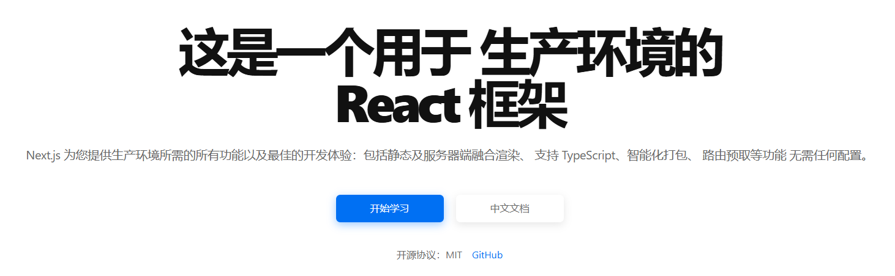

---

- 推荐先学习：
- HTML
- CSS
- JavaScript
---

1. **Vue**[Vue](https://cn.vuejs.org/) 是一款用于构建用户界面的 JavaScript 框架。它基于标准 HTML、CSS 和 JavaScript 构建，并提供了一套声明式的、组件化的编程模型
帮助你高效地开发用户界面。无论是简单还是复杂的界面，Vue 都可以胜任。
[<u>Vue.js - 渐进式 JavaScript 框架 | Vue.js (vuejs.org)</u>](https://cn.vuejs.org/)

---

1. **React**[React](https://react.docschina.org/) 是一个用于构建web和原生交互界面的库，起源于 Facebook 的内部项目，用来架设 Instagram 的网站，并于 2013 年 5 月开源。
[<u>React - 用于构建 Web 和原生交互界面的库 | react.docschina.org</u>](https://react.docschina.org)

---

1. **Tailwind CSS**[Tailwind CSS](about:blank) 只需书写html，无需书写css即可快速构建美观网站。
[<u>Tailwind CSS - 快速、灵活、可靠，没有运行时负担 | tailwindcss.cn</u>](https://www.tailwindcss.cn/)

---

1. **Next.js**[Next.js](https://nextjs.cn) 是一个用于 生产环境的React 框架，提供生产环境所需的所有功能以及最佳的开发体验：包括静态及服务器端融合渲染、 支持 TypeScript、智能化打包、 路由预取等功能  无需任何配置。
[Next.js - 用于生产环境的React框架 | nextjs.cn](https://www.nextjs.cn/)​

​
