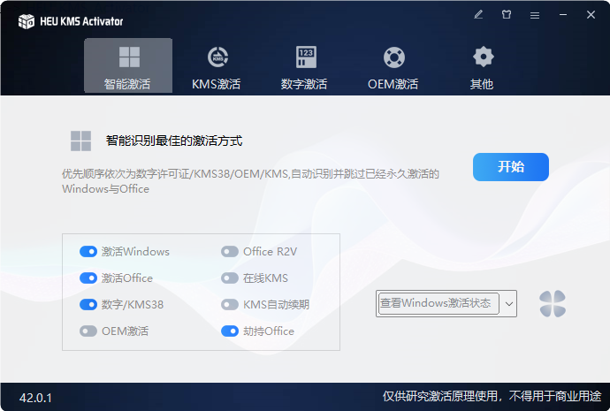
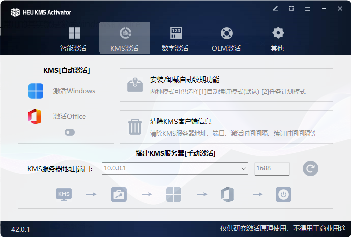
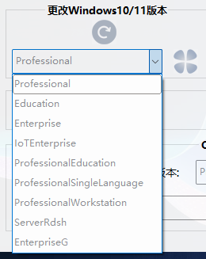

**老规矩，github链接奉上 -> **[**HEU_KMS_Activator**](https://github.com/zbezj/HEU_KMS_Activator)

---
功能很多，很强大，但其实常用的就是激活windows和office

当然你也可以通过kms服务器手动激活（如果你找得到的话）

你也可以在里面更改你的windows版本
**但极度不建议！！！很难说会出现什么bug**
**推荐使用虚拟机尝试**

