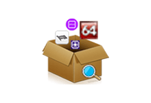

> 三千预算进图吧，小学对面开网吧

## 图吧，电脑DIY爱好者的聚集地
吧友们喜欢用尽可能少的钱组机，当垃圾佬去闲鱼淘二手零件，夸张到用鞋盒代替机箱
在这种环境下，当然有不少人会翻车，有的是捡到了十八手的矿卡，有的是读写速度20mb/s的固态硬盘
配件刚捡回来，你也需要进行烤cpu，烤显卡，硬盘分区等等操作...

---
## 这时，就有英雄挺身而出，开发出了这款及其便利的工具箱
链接奉上 -> [图吧工具箱 - 最纯净的硬件工具箱](https://www.tbtool.cn/)
那么，他有什么功能呢？
### 硬件信息
查看电脑基本配置，比鲁大师简洁很多

### CPU工具
包含cpu-z，cpu天梯图，aida64等
可以用来烤cpu，查看cpu频率，cpu跑分

### 主板工具
aida64，检测主板型号，查看南北桥信息，内存读写测试

### 内存工具
实际上这些工具都不如aida64

### 显卡工具
gpu-z用来看显卡信息，ddu可以强卸显卡驱动（慎用！），furmark甜甜圈烤显卡，还有英伟达和amd官网提供驱动下载

### 硬盘工具
as ssd benchmark用来测试硬盘读写，disk info显示硬盘基本信息，spacesniffer让你的硬盘占用可视化
其中diskgenius更是重量级，功能非常强大，功能包括硬盘分区、分区扩容、修改分区内容等等...

### 屏幕工具
新买了显示器？看看 有没有坏点吧！
还可以检测显示器色域，虽然参数看不懂QAQ

​
### 综合检测
还得是aida64，图拉丁硬件检测也还行

### 外设工具
检测硬盘是否正常输入，还可以看你的鼠标会不会双击
~~（点名批评razer/logi）~~

### 烤鸡工具
烤显卡，烤cpu...
烤，都能烤

### 其他工具
大部分和系统激活有关，这里不一一介绍

