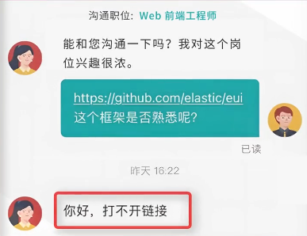

> 你好，打不开链接.jpg

> 

---
**功能很多！还能加速github**
**虽然这只是watt toolkit的附加功能...**
**链接先奉上 -> **[**瓦特工具箱(Steam++官网) - Watt Toolkit**](https://steampp.net/)
软件最核心的功能就是网络加速
支持steam以及github的一键加速

若加速无效，请尝试在加速设置->代理设置->自定义DoH地址里修改成默认提供的其他DoH地址

但毕竟Watt Toolkit的原名是Steam++，当然包含和steam相关的其他内容，这里就不做过多赘述

