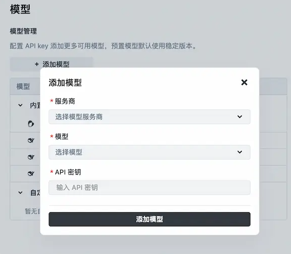
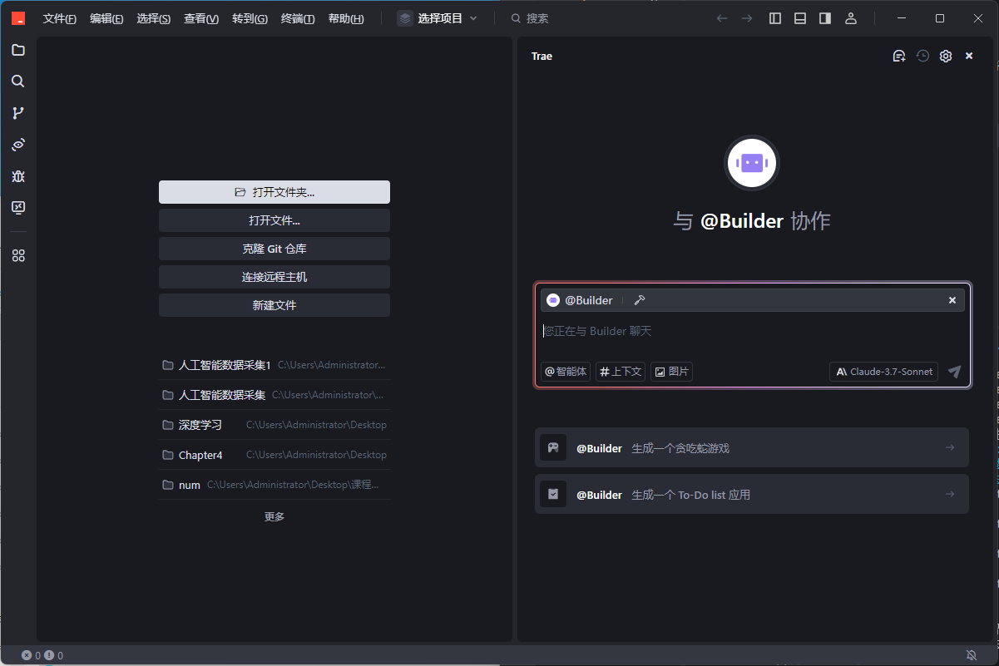
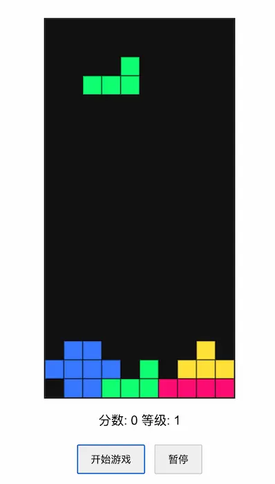

# Trae使用教程：国产AI工具的进阶探索
## 一、Trae概述
Trae作为一款国产AI工具，具备显著优势。它拥有中文界面和文档，为国内用户提供了极大的便利，无需担心语言障碍。与多数需要付费的国外同类产品不同，Trae完全免费，降低了用户的使用门槛。
Trae有插件和IDE两种形态，其IDE又细分为国内版和海外版。这两个版本功能大致相同，但内置AI模型有所差异。
国内版内置deepseek R1、V3、v3 - 0324和doubao 1.5 pro模型；
海外版则内置Claude 3.5、3.7，Gemini 2.5 pro，GPT - 4o、GPT - 4.1模型。
考虑到海外版使用时，内置模型常需排队等待，且可能出现通信问题，推荐优先使用国内版。
不过，两个版本均支持自定义模型接入，用户只需提供密钥，就能指定使用自己的模型，从这方面来讲，版本差异的影响不大。

“Trae”一词代表“The Real AI Engineer”（真正的AI工程师），传达了开发者的理念与追求，和许多人之前误解的“True Ai”含义不同。
## 二、Trae新版本

### （一）版本更新获取
若尚未安装Trae，可前往Trae官网下载最新的v0.5.0版本。已安装的用户，需检查当前版本并及时更新，以体验新功能。
### （二）界面简化
新版本对界面进行了优化，将聊天框和Builder（项目生成）整合为一个对话框。此后，所有与AI的交互对话都在该对话框中进行，操作更加集中、便捷。
### （三）新增核心功能按钮
在更新后的界面左下角，新增了“@智能体”和“#上下文”两个按钮，这是v0.5.0版本的核心更新内容。其中，“@智能体”按钮与MCP调用功能紧密相关，是扩展AI功能的关键入口，我们将在后续详细介绍其使用方法。“#上下文”按钮的具体功能可能因软件而异，在实际使用中可进一步探索其用途。
## 三、调用智能体功能详解
### （一）智能体调用入口
MCP调用功能的入口便是界面左下角的“@智能体”按钮，在对话框中直接输入“@”也能唤起相同功能。由于AI模型本质为语言模型，功能存在局限性，需借助外部应用（即智能体）来拓展其能力，这便是“@智能体”按钮的重要意义所在。
### （二）内置智能体介绍及使用
点击“@智能体”（或输入“@”）后，会弹出对话框展示当前可用的智能体。Trae目前内置了“@Build”和“@Builder with MCP”两个智能体。

- **“@Build”智能体**：主要用于让AI生成可运行的新项目。例如，在对话框中输入“@Build俄罗斯方块网页小游戏”指令，Trae便会基于其内置的AI模型生成一个HTML文件。生成完成后，找到该文件并打开，就能直接体验俄罗斯方块小游戏。通过这一智能体，用户能够轻松获取由AI创建的各类项目，无论是简单的网页游戏，还是其他类型的项目，都能快速生成，为用户提供了极大的便利和创意实现途径。其中，"@Build"用来让 AI 生成一个可运行的新项目。
@Build 俄罗斯方块网页小游戏
输入上面的命令，就会生成一个 HTML 文件，打开就是俄罗斯方块小游戏。

- **“@Builder with MCP”智能体**：该智能体主要用于连接MCP服务器。连接MCP服务器后，用户可以借助服务器的资源和功能，进一步拓展Trae的应用场景和能力边界。虽然目前其具体功能可能还需要在实际使用中进一步探索，但可以预期，通过连接MCP服务器，用户将获得更强大的AI支持，实现更复杂的任务和需求。​
