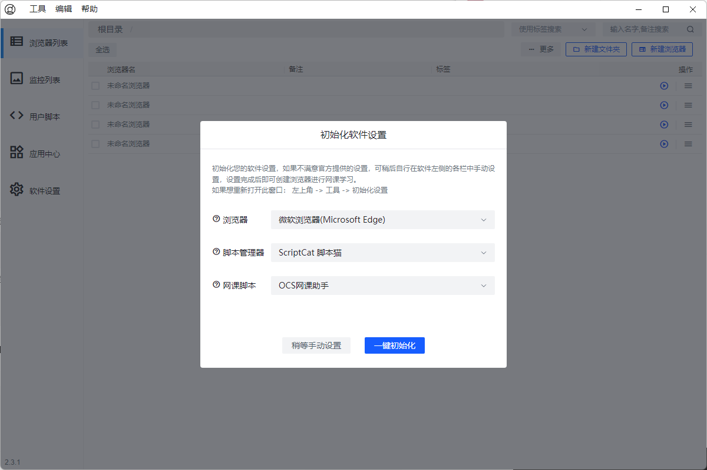
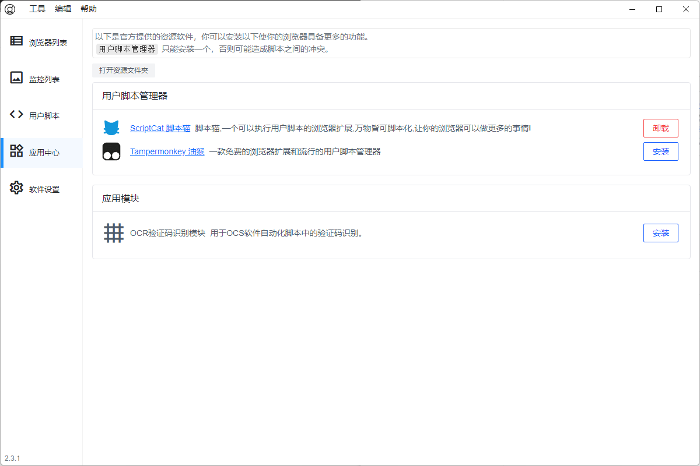
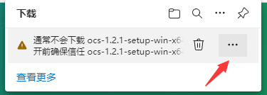
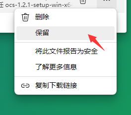

网址：[https://docs.ocsjs.com/](https://docs.ocsjs.com/)
# 软件教程

---
## 目录
[软件介绍](https://docs.ocsjs.com/docs/app/#%E8%BD%AF%E4%BB%B6%E4%BB%8B%E7%BB%8D)
[视频使用教程](https://docs.ocsjs.com/docs/app/#%E8%A7%86%E9%A2%91%E4%BD%BF%E7%94%A8%E6%95%99%E7%A8%8B)
[软件下载](https://docs.ocsjs.com/docs/app/#%E8%BD%AF%E4%BB%B6%E4%B8%8B%E8%BD%BD)
## 软件介绍

- OCS 桌面端软件， 适合多人使用 👨‍👧‍👧 浏览器多开/分身 网课账号管理 自动登录 等功能
- 使用一键初始化按钮，可以直接安装脚本和脚本管理器，创建浏览器后点击运行即可一键刷课，傻瓜式操作。




## 视频使用教程
视频最后出现了 OCS 脚本，后续可以按照脚本上面的提示进行网课学习
## 软件下载
### 下载须知
如果 edge 下载后弹出类似的框，点击 ，选择保留即可

 

### 软件下载列表
提示
Mac 用户如果提示 **文件损坏**，可以参考 [知乎-MacOS 文件损坏解决方案](https://www.zhihu.com/search?type=content&q=Mac%E6%96%87%E4%BB%B6%E6%8D%9F%E5%9D%8F%E8%A7%A3%E5%86%B3%E6%96%B9%E6%A1%88)
下载后会有使用的教程，非常简单。
#### OCS 软件 ```v2.7.5
```

 | **操作系统** | **下载链接** | 
|---|---|
 | Windows | [https://cdn.ocsjs.com/app/download/ocs-2.7.5-setup-win-x64.exe](https://cdn.ocsjs.com/app/download/ocs-2.7.5-setup-win-x64.exe) | 
 | MacOS | [https://cdn.ocsjs.com/app/download/ocs-2.7.5-setup-mac-arm64.dmg](https://cdn.ocsjs.com/app/download/ocs-2.7.5-setup-mac-arm64.dmg) | 
 | Ubuntu | [https://cdn.ocsjs.com/app/download/ocs-2.7.5-setup-linux-x86_64.AppImage](https://cdn.ocsjs.com/app/download/ocs-2.7.5-setup-linux-x86_64.AppImage) | 
 | 更多架构下载 | [https://github.com/ocsjs/ocs-desktop/releases/latest](https://github.com/ocsjs/ocs-desktop/releases/latest) | 

- ```浏览器多开/分身
```
：每个浏览器账号数据互相隔离，可实现多个浏览器不同账号登录。
- ```傻瓜式一键安装所有运行环境
```
：包括： 浏览器拓展，用户脚本等
- ```浏览器管理
```
：支持浏览器增删改查，浏览器标签分类，浏览器备注说明。
- ```浏览器监控
```
：多个浏览器图像查看，并支持单个点击置顶进行操作，避免全部浏览器堆在一个显示器上查找困难。
- ```OCS全局配置同步
```
：OCS 软件可以支持 OCS 脚本的所有配置同步以及独立配置，实现多个浏览器的 OCS 脚本配置同步，例如：```题库配置全局同步
```
，无需一个个进行设置。
- ```自动化脚本
```
：网课自动登录，自定义页面打开等自动化操作。
- ```批量上号
```
：浏览器批量运行，以及批量执行自动化脚本实现批量上号