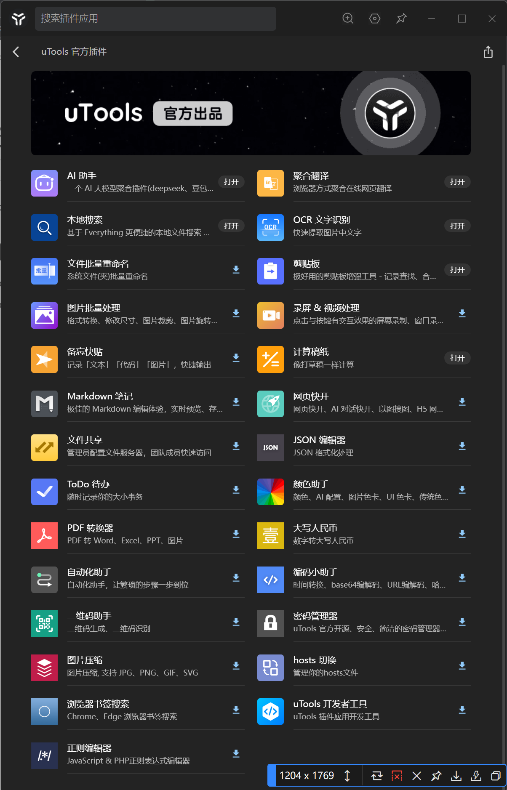

网址：[https://www.u-tools.cn/index.html](https://www.u-tools.cn/index.html)
以下体验基于Windows系统，不同系统可能略有出入。
# 软件介绍
Utools是一款类似Mac端“聚焦搜索”的软件。类似于Mac端的 **Command+空格**，Utools的调用是 **Alt+空格**。
Utools的优势在于它的插件生态，官方出品的插件特别好用，贴张图片~

我个人常用的是网页快开，从剪切板获取一个网页，调出uTools，粘贴，Enter访问，默认浏览器打开，一气呵成。
## 它还有个最实用的点，软件快开。
你可以在**任何地方**调出uTools，输入**已安装应用的拼音，支持缩写，不区分大小写，英文应用输入名称**。如“微信”，我可以输入“wx”“wEixiN”；Steam我就输入“sTEAM”（这里展现的是它不区分大小写的特性）。
**这样我就不用返回桌面点击应用图标了**​
### 你也可以看到你最近打开的应用，非常贴心。

我用它代替了Windows的搜索框，嘎嘎好用。
插件功能就靠大家自行探索了，官方插件都很好用！
## 下载链接：
[https://www.u-tools.cn/download/](https://www.u-tools.cn/download/)
选择对应系统版本进行下载即可~
​
## 希望能提高大家的工作效率！
