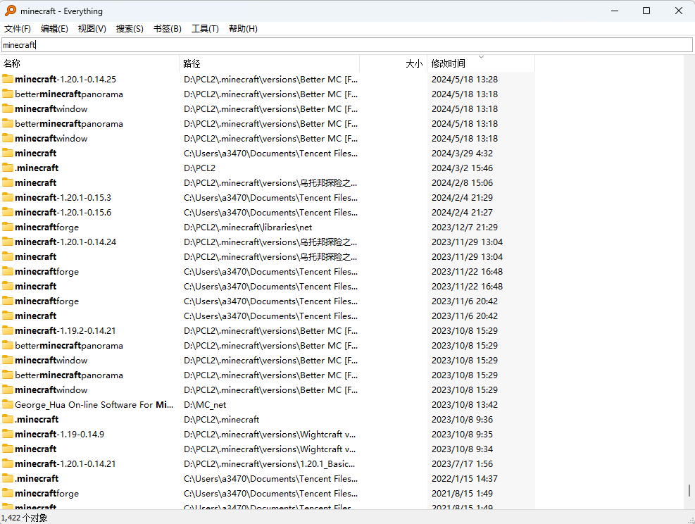
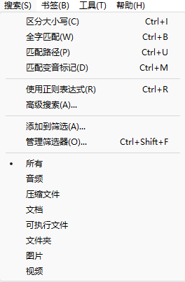
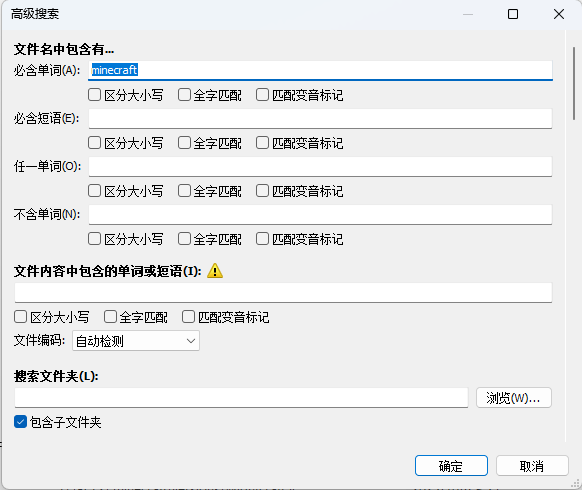
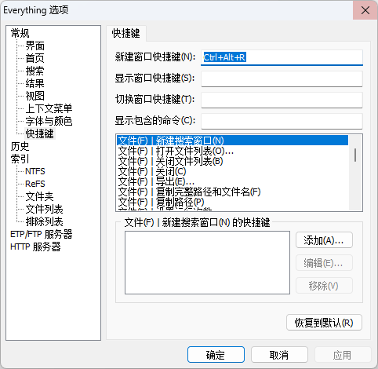

windows资源管理器中自带的搜索功能实在是太鸡肋了。
你应该试试[**Everything**](https://www.voidtools.com/zh-cn/)**！！！**

Everything是一款小巧、高效、低占用的搜索工具
你可以用它在电脑上找到一切你需要的文件，并且速度超快，不用在资源管理器的搜索界面苦苦等待

除此之外，你还可以限定搜索范围、添加快捷键、开机自启等功能，用来找文件真是**非常方便**！

官网下载链接：[Everything](https://www.voidtools.com/zh-cn/downloads/)

