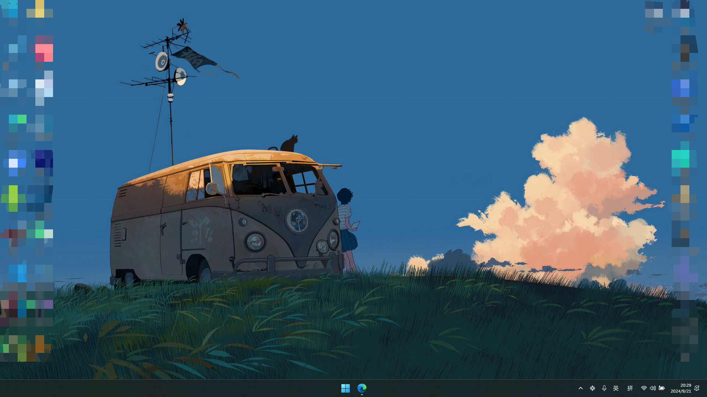
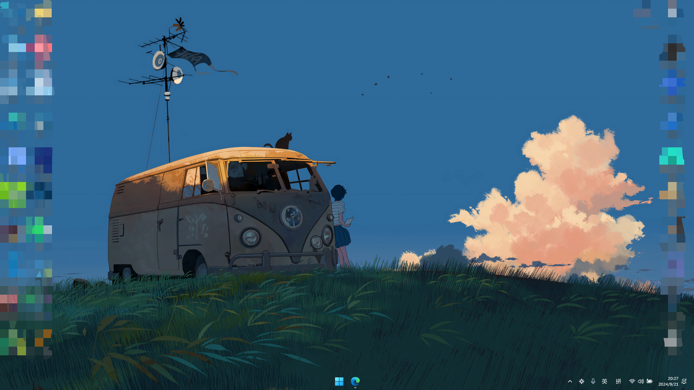
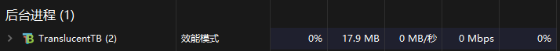
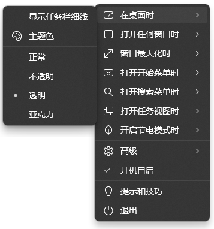

这是一个让你的任务栏透明化的工具。[Translucenttb](https://github.com/TranslucentTB/TranslucentTB)

---
使用前，你的任务栏是这样不透明的

使用后就变成了这样

​
**搭配小红车，配上好看的壁纸，桌面一下子就变得很高级了有没有~**
同时其后台资源占用很低，各位也不用怕它在后台占用资源~~（点名批评小红车）~~

Translucenttb也支持各种个性化配置，这个大家根据喜好自行调整就好了

github项目下载地址：
[Releases · TranslucentTB/TranslucentTB (github.com)](https://github.com/TranslucentTB/TranslucentTB/releases)
微软商店也可以下载，搜索Translucenttb即可~
