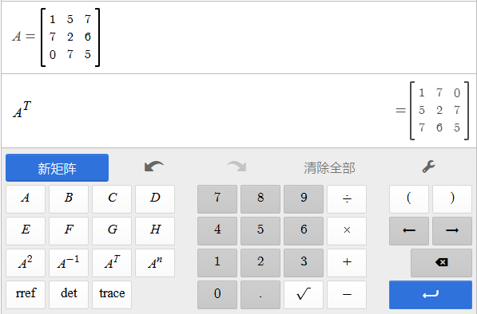

先附上网址：[**Desmos**](https://www.desmos.com/?lang=zh-CN)
**Desmos是一个免费的数学工具组**
包含函数**图形、几何、矩阵、3d工具，计算器等**
各种有意思的功能等待你来发掘！

1. **图形**你可以在这里打出函数式子，**网站会*****自动生成图像*****！****如下图**

或者**设定多个*****变量*****，添加*****滑块***
观察随着变量变化，函数图像的变化

1. **科学计算器 & 四功能计算器**平平无奇的计算器 ~~似乎没什么用~~

​

1. **矩阵计算器****自定义多个*****矩阵***，计算乘积、和、差...等等！

1. **3D图像**你可以使用函数，**网站会*****自动生成*****对应的*****3d图像*****！**

**​**
**<u>Desmos的可玩性很强，还望大家能多多发掘</u>**
