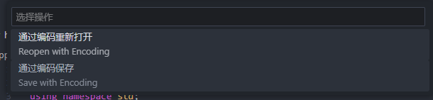

**大概率是编码问题**，看右下角编码是否为GBK，默认一般是UTF-8编码！

---
解决方法很简单，在项目文件的.vscode文件下找到setting.json

以c++为例，在对应语言下添加"files.encoding":"gbk"即可解决！
添加的上方如果还有其他设置，记得加个逗号！

先前创建的c/c++文件更改编码方式只需在对应文件下按ctrl+shift+p，搜索“更改文件编码”，通过编码保存，选择GBK即可

快去愉快的coding吧~

