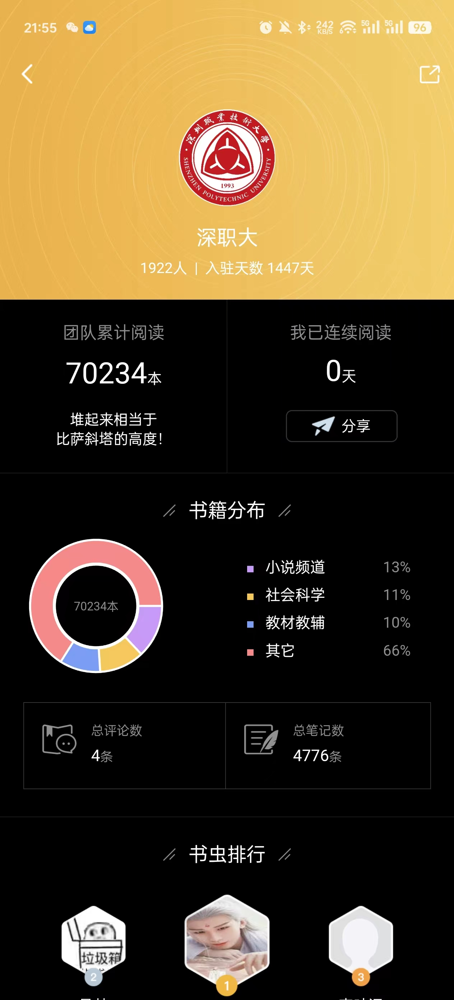
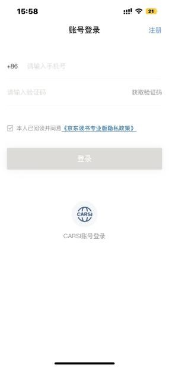
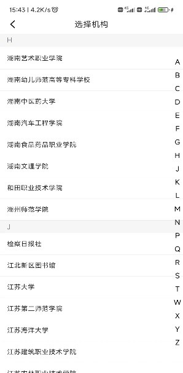
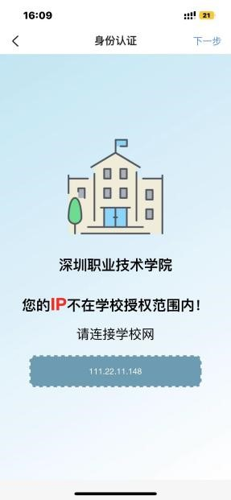

**⚠️****注意****⚠️****：一定要连接 SZPU-WIFI 才可以注册，注册后无需连接校园网（SZPU-WIFI）也可以使用！！！**

**文章转载自：**[**https://lib.szpu.edu.cn/databaseguide/web_dataBaseDetail?databaseid=szptjd51zhaoshubook**](https://lib.szpu.edu.cn/databaseguide/web_dataBaseDetail?databaseid=szptjd51zhaoshubook)
# **一、资源简介**
京东读书专业版，是一个以新书为主的电子书阅读平台。依托京东图书行业背景，与 500 多家出版社直接合作，平台资源丰富且新书更新快，现有 20 多万册正版电子，涉及哲学、经济学、法学、文学、历史学、医学、管理学、艺术、工业科技等十多个学科。 每月定期更新新书，年更新 3~5 万册。  **我校师生可不限时间、不限地点，无限制阅读平台内正版电子书全文****。**
京东读书专业版 APP 阅读功能完善，支持看书与听书，支持在线阅读与离线阅读，支持做笔记和导出笔记等，同时，平台内设圈子，支持本校读者线上交流，线下交友。
# 二**、访问方式**

1. 校内访问：校园网内免登网址 [http://www.51zhaoshu.net:8100/ebook/login/2851](http://www.51zhaoshu.net:8100/ebook/login/2851)
2. 校外访问：
1. [WebVPN](https://vpn5.szpt.edu.cn/) 
2. [VPN 客户端](https://www.szpt.edu.cn/info/1103/2524.htm) 
3. [MyLOFT](https://lib.szpt.edu.cn/databaseguide/detail/3117) 远程访问插件（[注册安装指南](https://libfile.szpu.edu.cn/contentdelivery/20230321/619BCD4B1AE8D97DDA5E56A1B062F31E_8480BBD5C1060C58FD699E98E9C6F098.pdf)）以上三种使用方法[详情点击这里](https://lib.szpt.edu.cn/home/ServiceDetail/28175)
4. 校内[注册个人账号](https://m-tob.jd.com/user_login)，**注册完后使用手机号 + 验证码登录，不限 IP 使用**。
5. 京东读书专业版 APP# **三、**个人**账号注册流程**

1. 点击 [https://m-tob.jd.com/user_login](https://m-tob.jd.com/user_login) 进入京东读书专业版个人账号登录界面，点击 “注册” 后选择本人所在机构。

1. 身份认证：**请连接校园网进行身份认证**，否则会提示 “不在 IP 范围内”。
2.  账号注册：输入姓名、手机号及验证码确认完成账号注册。
3. **注册完后，不限制校园网环境，通过手机号 + 验证码登录访问**。​

# **四、APP 下载方式**
安卓系统可通过华为应用市场、小米应用商店、百度手机市场等应用市场搜索 “京东读书专业版” 下载。苹果系统可通过 appstore 下载。或者微信扫码下方二维码直接下载：
​

# **五、责任馆员      张淑玲** （ Tel:26019679   内线 8679 ）
# **六、特别提示**
​ **免登陆链接仅限校园网环境内打开阅读，无需个人账号直接访问。京东读书专业版 APP 及网站支持个人账号登录进行远程访问，不限 IP。**
(更新时间：20230321）
