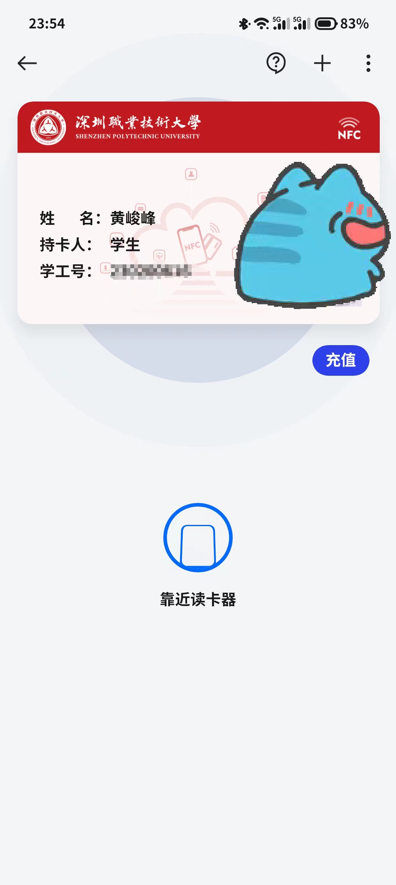

如果你用的是有nfc的安卓手机......
你还在用深职通码支付？布什，戈门！

---
​
下面就教大家如何在人群中脱颖而出，用NFC支付~ 
ps：苹果手机暂无法录入

1. 访问 [https://yktwx.szpt.edu.cn/plat](https://yktwx.szpt.edu.cn/plat)，到达以下页面

1. 点击“我的”并登录

1. 点击“大厅”，找到“NFC”，点进去

1. 找到对应手机品牌，点击

1. 点击领取

1. 记得点跳转

1. 等待开卡成功即可

1. 打开NFC界面就可以去食堂/小卖部愉快的滴卡了

> **注意事项：**
**本教程录入的NFC是校园卡的加密部分，用于支付，无法使用门禁功能**
**各位可以自行尝试用校园卡直接当成门禁卡录入手机，这样录入的是未加密部分，二者合一相当于完整校园卡**
**​**
**经过测试，部分型号手机无法直接录入校园卡！**
**如果你的安卓手机支持NFC，但一卡通中的支持手机型号没有你的手机型号，也可以尝试录入！**
**苹果手机暂无法录入**

**~~这下终于可以在朋友面前露一手了！~~**

