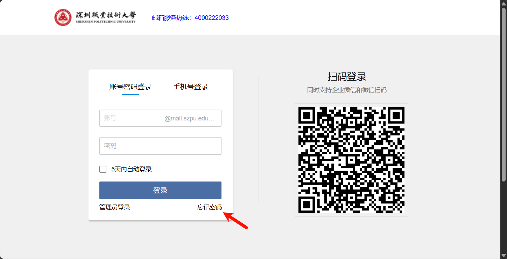
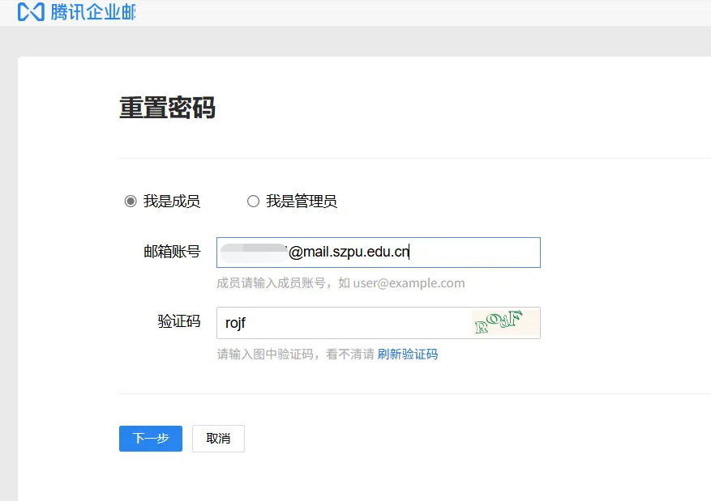
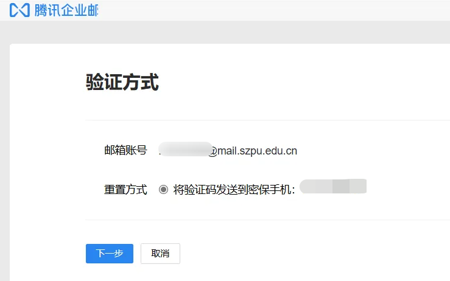
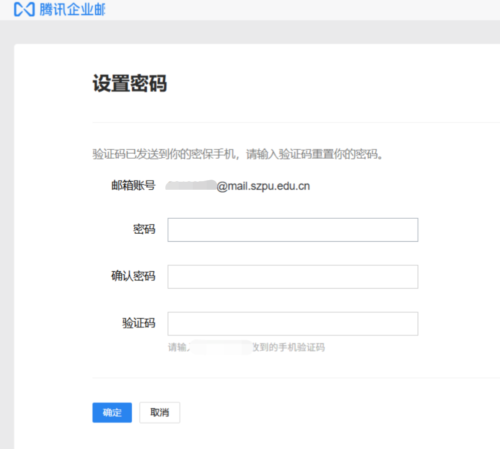
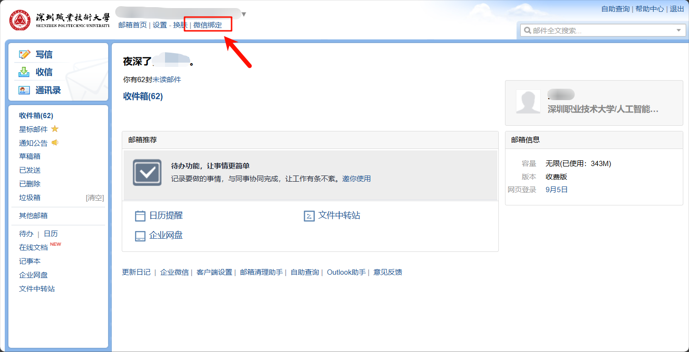

校园邮箱通常是指以学校域名结尾的电子邮件地址，例如 ```学号@学校域名.edu.cn
```
，其中 ```.edu.cn
```
 是中国教育网的域名后缀。
许多软件和服务提供商为持有校园邮箱的用户提供**折扣**或**免费使用权限**，例如 微软、JetBrains、Autodesk 等。  
# 邮箱的登录

1. 访问 [http://mail.mail.szpu.edu.cn/](http://mail.mail.szpu.edu.cn/)，点击 “忘记密码”


1. 邮箱账号为 学号@mail.szpu.edu.cn，如：22190700@mail.szpu.edu.cn


1. 使用手机号验证


1. 重置密码


1. 重置密码后回到登录界面，使用刚才的密码登录。登录完成后点击“微信绑定”，绑定完成后即可使用微信扫码登录

# 教育优惠列表
## [JetBrains 全家桶](https://www.jetbrains.com/)
 JetBrains 是一家总部位于捷克布拉格的全球知名软件公司，成立于2000年。公司专注于开发智能开发工具，旨在提高程序员的生产力和代码质量。JetBrains 的工具广泛应用于各种编程语言和开发环境中。
一些著名的 JetBrains 产品包括：

1. **IntelliJ IDEA**：一款功能强大的 Java 集成开发环境（IDE），支持多种编程语言，包括 Kotlin、Groovy 和 Scala。
2. **PyCharm**：专为 Python 开发者设计的 IDE，提供强大的代码补全、调试和测试功能。
3. **WebStorm**：用于前端开发的 IDE，支持 JavaScript、TypeScript 及相关技术的开发。
4. **PhpStorm**：为 PHP 开发提供支持的 IDE，具有高级代码分析和调试功能。
5. **ReSharper**：一个用于 Microsoft Visual Studio 的扩展，提供代码分析、重构和导航功能。​
申请方法：

## [Autodesk](https://www.autodesk.com/)
 Autodesk 是一家全球领先的软件公司，专注于设计和工程领域的解决方案。它成立于1982年，总部位于美国加利福尼亚州旧金山。Autodesk 提供了一系列应用程序，帮助用户在建筑、工程、制造、娱乐等行业进行设计、可视化和模拟。
一些著名的 Autodesk 产品包括：

1. **AutoCAD**：广泛应用于建筑和工程领域的计算机辅助设计（CAD）软件。
2. **Revit**：用于建筑信息建模（BIM）的工具，帮助设计师和工程师创建和管理建筑信息。
3. **Maya** 和 **3ds Max**：强大的三维建模、动画和渲染软件，广泛用于影视、游戏和视觉效果行业。​
申请方法：

PS：为了方便申请教育资格，注册账户时，邮箱一定要填写学校的邮箱。
## GitHub Student Developer Pack
GitHub Student Developer Pack 提供的优惠内容非常广泛，涵盖了多个领域的开发工具、学习资源、设计和生产力工具。
以下是按不同类别对这些优惠进行分类和描述，**标红的**是我认为比较实用的工具：
### 1. **开发工具 (Developer Tools)**

- **GitHub**: 免费 GitHub Pro 订阅。
- **GitHub Copilot**: 学生可免费使用 GitHub Copilot。
- **GitLens**: 免费 GitKraken Pro 许可证，解锁 GitLens 和 GitKraken 开发体验平台的 Pro 访问权限。
- **GitHub Codespaces**: 免费 Codespaces Pro 级别访问权限。
- **JetBrains**: 免费使用 JetBrains 专业 IDE（如 IntelliJ IDEA、PyCharm）订阅。
- **GitKraken**: 免费 GitKraken Pro 许可证，支持跨平台的 Git 客户端。
- **Travis CI**: 学生可免费进行私有构建。
- **SQLGate**: 一年免费访问 SQLGate 的标准功能。
- **BrowserStack**: 免费自动化移动计划 1 并行用户，持续一年。
- **Sentry**: 包含 50K 错误、100K 事务等学生免费套餐。
- **DeepSource**: 为 GitHub 教育包学生免费使用的静态代码分析平台。
- **SymfonyCasts**: 免费 3 个月的 Symfony 和 PHP 视频教程订阅。
- **Codecov**: 支持公共和私有库的代码覆盖率服务。
- **Xojo**: 免费 Xojo Pro 许可证，支持跨平台应用程序开发。
- **Restyled**: 免费为学生的私有库运行自动格式化 Pull Requests。### 2. **云服务 (Cloud Services)**

- **Microsoft Azure**: 免费访问 Azure 服务和 $100 的 Azure 信用额度。
- **Heroku**: 每月享受 $13 的信用额度，持续 24 个月。
- **DigitalOcean**: 一年 $200 平台信用额度。
- **Name.com**: 免费 .LIVE 域名、隐私保护和 SSL 证书。
- **Datadog**: 提供免费的 10 服务器监控 Pro 账号，持续两年。
- **MongoDB**: 提供 $50 的 MongoDB Atlas 信用额度和免费认证。
- **Vaadin**: 提供免费 Pro 订阅许可证，解锁商业组件和工具。### 3. **设计工具 (Design Tools)**

- **Icons8**: 提供 3 个月的免费订阅，包含图标、照片、插图等设计资源。
- **IconScout**: 每月免费使用 60 个精选图标，持续一年。
- **Octicons**: 提供 Figma 设计的 Octicons 图标库。
- **Bootstrap Studio**: 免费获得 Bootstrap Studio 许可证，支持响应式网站设计。
- **Themeisle**: 免费一年 Neve Agency WordPress 主题。
- **Visme**: 提供 3 个月的免费 Starter 计划访问，用于创建交互式演示文稿、数据可视化等内容。### 4. **学习资源 (Learning Resources)**

- **Educative**: 提供 6 个月免费访问超过 70 门课程，涵盖 Web 开发、Python、Java 等内容。
- **FrontendMasters**: 免费 6 个月的所有课程和工作坊访问。
- **Codedex**: 提供 6 个月的 Codédex Club 会员，学习 Python、HTML、CSS 等课程。
- **DataCamp**: 提供 3 个月免费订阅，学习数据科学课程。
- **AlgoExpert**: 免费访问 20 道编程面试题，并享受 10% 的折扣。
- **GoRails**: 一年免费访问 Ruby、Rails、JavaScript 等视频教程。### 5. **生产力工具 (Productivity Tools)**

- **Notion**: 提供 Notion Education 计划，包含 AI 响应功能。
- **PomoDone**: 提供两年免费的 PomoDone Lite 计划，帮助提升生产力。
- **Dashlane**: 提供 6 个月的 Dashlane Premium 免费访问，作为云密码管理工具。
- **DailyBot**: 提供 6 个月的 DailyBot 商业计划，适用于 10 名用户。### 6. **安全与监控 (Security & Monitoring)**

- **AstraSecurity**: 提供 6 个月的防火墙和恶意软件扫描器访问权限。
- **Blackfire**: 提供免费开发者订阅，用于代码性能测量。
- **Honeybadger**: 提供免费一年的小型账户，用于异常、运行时间和任务监控。### 7. **移动应用开发 (Mobile App Development)**

- **Kodika**: 提供 6 个月 Kodika Unlimited Pro 订阅，用于 iOS 应用程序开发。
- **WorkingCopy**: 提供 iPhone 和 iPad 上的 Git 客户端 Pro 功能免费访问。
- **Termius**: 提供 SSH 客户端 Pro 订阅，支持桌面和移动设备。### 8. **虚拟事件与域名管理 (Virtual Events & Domain Management)**

- **Namecheap**: 提供 1 年 .me 域名注册及 1 年免费 SSL 证书。
- **StreamYard**: 提供虚拟活动平台 Essential 计划免费访问。
- **Typeform**: 提供 1 年的 Typeform 专业计划。
- **Mailgun**: 每月免费发送 20,000 封电子邮件，并进行 100 次验证。### 9. **物联网与硬件 (Internet of Things & Hardware)**

- **Arduino**: 提供 6 个月的免费 Arduino Cloud 访问权限及部分硬件折扣。
- **Adafruit**: 提供一年免费访问 Adafruit IO+ 服务，并获得部分硬件折扣。### 10. **API & 基础设施 (APIs & Infrastructure)**

- **Stripe**: 处理前 $1000 收入的交易免手续费。
- **Pageclip**: 为静态网站和 HTML 表单提供免费服务器托管基础计划。
- **Blockchair**: 提供 100,000 次免费区块链 API 请求。
- **Zyte**: 免费永远使用 Scrapy Cloud 单元，进行网络爬虫管理。​
申请略为麻烦，请自行在网络上搜索或自行尝试。

