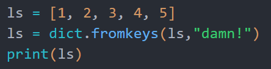
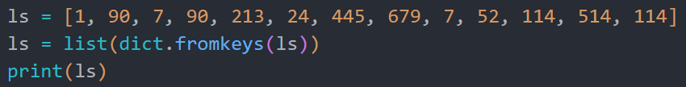
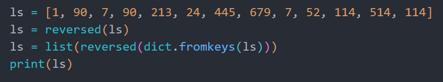
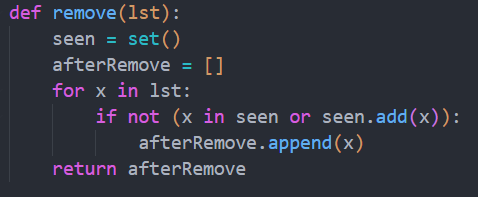
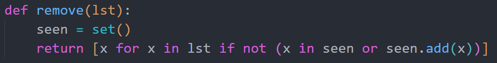
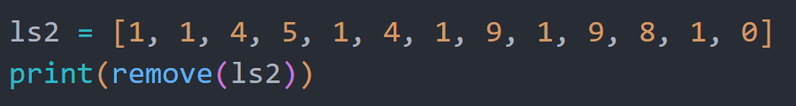
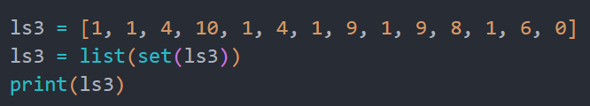

**"去重"操作在很多场景下都有使用需求，以下提供多种方法**
## 字典去重
**使用dict.fromkeys()**python中，字典这一数据结构提供了一个函数 ```dict.fromkeys()
```
 
它用于从一个可迭代对象（第一个参数，如列表、元组、字符串等）创建一个字典，并把每个元素作为字典的键，并为所有键赋一个相同的值(第二个参数)。 
```示例： OrderedDict.fromkeys(iterable, value)  
```



```输出：{1: 'damn!', 2: 'damn!', 3: 'damn!', 4: 'damn!', 5: 'damn!'}
```

​
**具体实现**利用字典中键不可重复的特性，我们可以用```dict.fromkeys()
```
把列表ls转成字典
第二个参数```value
```
不填，则字典值默认为```None
```
，不影响，直接转回列表就行


```输出：[1, 90, 7, 213, 24, 445, 679, 52, 114, 514]
```


聪明的你会发现：**去重后，对于重复元素，会保留索引最小的！**


**如果要保留索引最大的，翻转原列表并翻转字典即可**
```输出：[1, 90, 213, 24, 445, 679, 7,52, 514, 114]
```

## 集合去重（原序）
**背后原理**众所周知，集合里的元素无法重复，于是我们就可以定义一个空的集合，并遍历整个要去重的列表
如果遍历的元素在集合里出现过，就不加入列表
反之，如果遍历的元素没有在集合里出现，就同时加入集合并加入列表
**函数定义**不妨定义一个函数


如果```x
```
在```seen
```
里出现过，根据```or
```
操作符的逻辑，会执行后面的内容，于是```x
```
就被加入到```seen
```
里
同时，由于```.add()
```
的返回值为```None
```
，在```not
```
的反转下，```if
```
语句为真，随后```x
```
被加入到去重后的列表


或者大家可以试试更高级的一行写法，明白or操作符的逻辑即可
**效果展示**聪明的你又发现了：**和字典一样，去重后，对于重复元素，会保留索引最小的**


**如果要保留索引最大的，翻转原列表后去重，再翻转回来即可**
```输出：[1, 4, 5, 9, 8, 0]
```

## 集合去重（升/降序）
**背后原理**python有一个特性，当你把一个装满```int
```
的集合转为列表时，列表的元素会默认升序排列！
那就不用我们再去```sort
```
了，节约码量~
**效果展示**很简单吧~


```输出：[0, 1, 4, 6, 8, 9, 10]
```


---
> **“Life is short. You need Python”**

> “人生苦短，我用Python”

