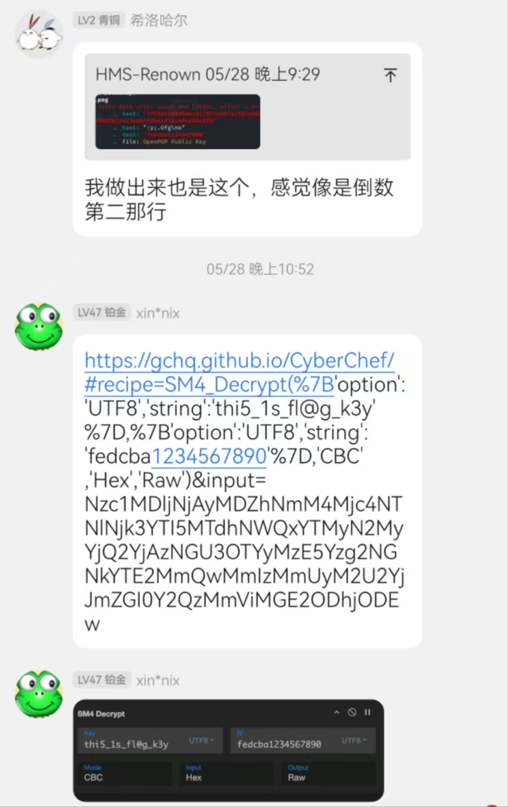

 	在黑客的世界里，当你拋出一个技术问题时，最终是否能得到有用的回答，往往取决于你所提问和追问的方式。
本指南将教你如何正确的提问以获得你满意的答案。 不只是黑客，现在开放源代码（Open Source）软件已经相当盛行，你常常也可以由其他有经验的使用者身上得到好 答案，这是件 好事 ；使用者比起黑客来，往往对那些新手常遇到的问题更宽容一些。然而，将有经验的使用者视为 黑客，并采用本指南所提的方法与他们沟通，同样也是能从他们身上得到满意回答的最有效方式  
——节选于pdf
在安全领域里，往往你要能清晰的意识到，仅仅看书或者等待，是完全不可能掌握什么知识的，尤其是在知识量愈发庞大的今天，如果在一个问题上存在卡顿，不要犹豫，迅速寻找其他的解决方案，即使是最简单粗暴的，只要有效，就快快端上来。
以我对安全圈交流氛围的观察，如果你单独提某种技术问题，如果态度诚恳，这些大佬绝对会倾囊相助的。（其他圈子里还真不一定，你甚至能看见一堆大叔在劝你放弃......）
​

