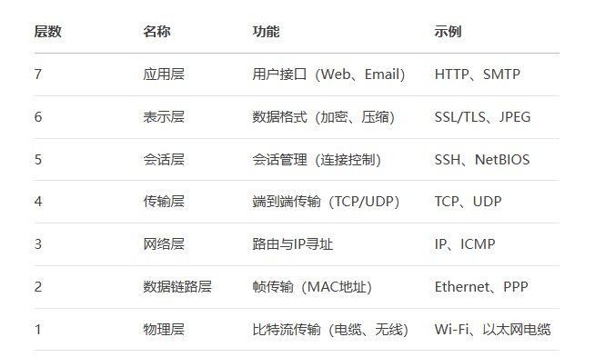
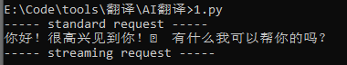

相信大多数人年少的时候都有一个黑客梦，或许是因为时间不够没法实现，也可能是因为没电脑。正所谓"学习黑魔法最好的地方是霍格沃茨的学院的黑魔法防御课程"，请相信现在的大学时间通过对网络安全的学习会是一个最好的入门时间。接下来，我从OSI七层模型中简单介绍一下各个层在网络安全中的应用，方便简单理解。

不需要时刻考虑这么多，当你熟悉这一切的时候，就能意识到计算机只存在两个永恒的东西：协议与数字。所有的一切只不过是千层蛋糕中的任何一层，你所要做的就是找到正确的协议解读方式，和一串正确的数字，还有合理的封装。
你可能会认为这句话不显得真实，诸如此多的新科技、新技术无法解释，那就直接拿最热门的AI来做一番示例，这里用一串来自火山引擎的AI使用代码（API已经废除，如需调用请使用自己注册的API）：
> 

当你修改里面的对话的时候，如果能结合过往对AI的各种周遭信息的理解，应该很快就能意识到两个问题（没意识也没关系）：
1、API中AI的随机种子是固定的
2、所有的大语言模型本质上是一个 [语言]转化数字，再通过数字通过计算并重新转化成[语言] 的函数，词频与位置会非常重要
了解到这些之后，可以尝试去试试各种所谓的"AI"创新，相信我，这个世界本质上就是个草台班子，所以尽管尝试吧，只需要别碰：钱和事业单位。

---
AI的话题先结束，我们接着来 黑客 的话题，只不过这个是关于自我保护的，请记住：
1、信息不可能凭空产生
2、日志会时刻记录你的活动
3、做任何事前都要评估风险，决定是否能接受再下手
先说 1 ，你是否经常在各大文娱作品中听说这么描述黑客的背景：*她必须不断抹除或扭曲有关自己的痕迹以保护自身 *？实际上，且不说这种方案是否理论可行，但是实际肯定是不可行的。因为信息一但上网、泄露，就算大半个地球听你的也想删都删不完，更科学且有效的方式是从一开始就小心输入任何与自己相关的信息，如果可行，第一份信息一定得用假的试试看，这实际上是因为很多无法保护好信息安全的小公司，他自然根本不会、也没法验证你输入是否是真实的。而有能力验证你信息输入真假的公司，一般也被强制性要求做好信息安全。（当然，这个世界本质上还是草台班子......所以泄不泄本质上是看运气的，你甚至经常能看见安全圈的真大佬在那抱怨自己的信息被严重泄露，然后被脚本小子开来开去的，但是也无所谓）
第二个，日志会记录你的活动，我们来重温一下连接校园网的过程，首先，你打开手机点击校园网络，其次校园网会通过DNS劫持的方式来指引你到它的登录界面。点击连接，即可上网。试问，有哪些地方有日志？简单说，第一个，手机上会保留你的连接记录，第二个，AP会记录连接者的mac地址，第三个，web服务器会记录你的cookie和登陆/访问时间，第四个，每次从内网向外网发出连接的时候防火墙都会记录连接的状态，第五个，会记录你移动中连接的AP编号，第六个，NAT中会保留有映射表。
第三个就不用我多说了，如果只是小恶作剧当然没什么大问题。

---
随着你深入网络安全领域，大概率会讨厌“黑客”的这种称呼，可能你会认为其他IT业中对“黑客”这一称号是当之无愧的技术大拿，就像是web3、开发者中的“黑客松”，但是作为纯粹的安全领域，外周多的是顶着“黑客”头衔的技术小白与莫名其妙的“小学生/初中生 黑客”然后再在漆黑的房间里对着高闪的屏幕一顿乱敲，且不说对眼睛的伤害性如何了，至少我真没看见线下这帮能溯源拿下病毒服务器的真“黑客”会顶着这么大的卫衣用三四个屏幕摇头晃脑的看数据。安全方面的信息从来没有被真正的隐藏，只不过太多信息噪点干扰了原本真实的技术信息，可能是人为的，但这不是讨论的重点，重点一直是：你想从中得到什么？你愿意付出什么？
