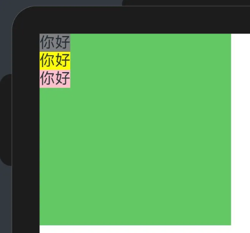

# 基础框架

- 基础框架要有以下结构，页面结构要写在build里面，build外面写结构使用的变量
```arkts
// 页面入口
@Entry
  // 组件
  @Component
  // 结构声名
  struct Index {
    // 页面结构内容
    build() {
      // 所有页面结构在这
    }
  }
```
# 基本语法

```arkts
组件名(参数) {
  内容
}
.属性1()
.属性2()
.属性2()
```
# 通用属性
通用属性在大多数组件上都可以使用

- ```.width(值)
```
```.height(值)
```

- ```值
```
 可以是一个百分数，表示占父容器的占比；也可以是一个数字值，单位是像素
- ```.backgroundColor(Color)
```

- ```Color
```
 可以是内置的颜色：```Color.xx
```

- ```Color
```
 也可以是RGB或RGBA：```rgb(r,g,b)
```
 /```rgba(r,b,b,a)
```

- ```Color
```
 也可以是十六进制值 ：```#FFFFFF
```
# 常用组件
## Text

- ```Text(xxx)
```

- ```xxx
```
 可以是任意文字
- ```.fontSize(number)
```

- ```number
```
 默认16，单位是像素
- ```.fontColor(Color)
```

- ```Color
```
 可以是内置的颜色：```Color.xx
```

- ```Color
```
 也可以是RGB或RGBA：```rgb(r,g,b)
```
 /```rgba(r,b,b,a)
```

- ```Color
```
 也可以是十六进制值 ：```#FFFFFF
```

- ```.fontWeight(number)
```

- ```number
```
 默认400，范围100~900
- ```nunber
```
 也可以用内置参数： FontWeight			```Lighter
```
 细
```Normal
```
 正常偏细
```Regular
```
 正常
```Medium
```
 适中
```Bold
```
 较粗
```Bolder
```
 最粗

```arkts
@Entry
  @Component
  struct Index {

    build() {

      Row() {
        
        Text("Hello")
          .fontSize(50)
          .fontColor(Color.Blue)
          .fontWeight(FontWeight.Lighter)
        
        Text("World")
          .fontSize(30)
          .fontColor(Color.Red)
          .fontWeight(FontWeight.Bold)
        
      }

    }

  }
```
## **Image**

- 可以通过链接显示图片：```Image('链接')
```
也可以显示本地图片：```Image($r'abb.media.图片名字')
```

本地图片要放在```src/main/resources/base/media
```
 文件夹中

- ```.width
```
 、```.height
```
 和```.aspectRatio
```
 的关系
- ```.width()
```
和```.height()
```
 可以填 ```像素值：width(**)
```
 或 ```百分比：height('**%')
```

- 填百分比时，设置的像素为```父级控件像素 * 百分比
```

- 不指定时，默认为文件自身像素
- 指定二者之一时，按照文件原始比例自动换算另一个值
- 二者皆指定时，图片按填充模式显示在指定范围内
- ```.aspectRatio()
```
 可以指定显示的宽高比，根据指定的二者之一自动换算另一个值 例如：```2
```
 → 2 : 1 、```0.5
```
 → 1 : 2 、```16/9
```
 → 16 : 9

- ```.objectFit
```
 可以设置图像的填充模式
- Cover，默认，图片缩放到完全覆盖组件范围
- Contain，按原始宽高比缩放至可以看见整个图像范围
- Fill，完全的拉伸填充
```arkts
@Entry
  @Component	
  struct Index {
    build() {
      
      Column() {
        
        Image('<https://www.szpu.edu.cn/__local/2/C9/5A/93A5D53164B29254751A298DDC0_9EC8EE92_65C54.png>')
          .width(100)
        
        Image($r('app.media.3705702'))
          .width(50)
          .height(100)
          .objectFit(ImageFit.Cover)
        
        Image($r('app.media.3705702'))
          .width(50)
          .height(100)
          .objectFit(ImageFit.Contain)
        
        Image($r('app.media.3705702'))
          .width(50)
          .height(100)
          .objectFit(ImageFit.Fill)
        
      }
      
    }
    
  }
```


## Button 按钮

- 格式1：不包含子组件```Button(文字, {按键类型, 是否开启点击动画效果}).参数
```


```arkts
Button('Ok', { type: ButtonType.Normal, stateEffect: true })
  .borderRadius(8)
  .backgroundColor(0x317aff)
  .width(90)
  .height(40)
```

- 格式2：包含子组件```Button({按键类型, 是否开启点击动画效果}){子组件}
```


```arkts
Button({ type: ButtonType.Normal, stateEffect: true }) {
  Row() {
    Image($r('app.media.icon'))
      .width(20)
      .height(40)
      .margin({ left: 12 })
    Text('icon')
      .fontSize(12)
      .fontColor(0xffffff)
      .margin({ left: 5, right: 12 })
  }
  .alignItems(VerticalAlign.Center)
}
.borderRadius(8)
  .backgroundColor(0x317aff)
  .width(90)
  .height(40)
```

- 按钮类型按钮有三种类型，通过type: ButtonType.???参数来确定 
- 普通按钮（Normal）

```.borderRadius(xxx)
```
 参数可以设置圆角，默认为零

- 胶囊类型（Capsule）

按钮的圆角自动设置为高度的一半，无法更改

- 圆形按钮（Circle）


- 添加事件通过```onClick
```
 事件响应操作后的行为

```arkts
Button('Ok', { type: ButtonType.Normal, stateEffect: true }) 
  .onClick(()=>{ 
    console.log('Button was pressed') 
  })
```
## 主轴对齐 ```Row
```
 和```Column
```


- ```Row
```
 是根据横轴的线性布局，方向由左至右；
- ```Column
```
 是根据纵轴的线性布局，方向由上至下，
- 根据主轴的对齐方式有如下方法（纵轴同理）：.justifyContent(FlexAlign.xxx)```Start
```

相贴且首段


```Centet
```

相贴且居中


```End
```

相贴且靠尾端


```Spacebetween
```

第一个元素靠首，第二个元素靠尾，剩余元素根据第一和第二个元素平均分布


```SpaceAround
```

各个元素的两端有相同尺寸的距离


```SpaceEvenly
```

元素与元素、元素与边界之间的距离相等


## 交叉轴对齐

- 交叉轴就是和主轴垂直的轴，属性是```alignItems()
```
Row(横)的交叉轴参数是 VerticalAlign	Top 顶部对齐
```.alignItems(VerticalAlign.Top)
```


Center 居中
```.alignItems(VerticalAlign.Center)
```


Botton 底部对齐
```.alignItems(VerticalAlign.Bottom)
```


Column(纵)的交叉轴参数是 HorizontalAlignStart 左对齐
```.alignItems(HorizontalAlign.Start)
```



Center 居中
```.alignItems(HorizontalAlign.Center)
```


End 右对齐
```.alignItems(HorizontalAlign.End)
```


