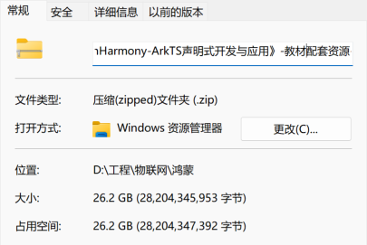

重要的事说三次：
别碰！非必要不要学！
别碰！非必要不要学！
别碰！非必要不要学！
别问为什么, 除非你想赤石
​
这篇文章基本参考了以下的链接，如果有看不懂的可以在以下链接查询
环境的安装可以参考👇第一个链接
[2025年广东省大学生计算机设计大赛-OpenHarmony赛事培训讲义](https://flowus.cn/share/2ac1864d-2554-4bda-ad1b-c047ebda796e?code=9ADTS2)
[ArkTS语言介绍-学习ArkTS语言-基础入门 - 华为HarmonyOS开发者](https://developer.huawei.com/consumer/cn/doc/harmonyos-guides/introduction-to-arkts)
[ArkTS（方舟编程语言）-应用框架 - 华为HarmonyOS开发者](https://developer.huawei.com/consumer/cn/doc/harmonyos-guides/arkts)
[ArkUI（方舟UI框架）-应用框架 - 华为HarmonyOS开发者](https://developer.huawei.com/consumer/cn/doc/harmonyos-guides-V5/arkui-overview-V5)
​
各个版本的 DevEco Studio
[HarmonyOS下载中心（最新版本）](https://developer.huawei.com/consumer/cn/download/)
[DevEco Studio 4.0](https://developer.huawei.com/consumer/cn/forum/topic/0203137865666738203)
[OpenHarmony 4.0 Release 下载地址在很下面](https://docs.openharmony.cn/pages/v4.1/zh-cn/release-notes/OpenHarmony-v4.0-release.md)​
[DevEco Studio（ HarmonyOS 3.1/4.0及以下）](https://developer.huawei.com/consumer/cn/deveco-studio/archive/)
​
以下是一个学习平台的链接
[开源鸿蒙应用开发导读](https://docs.openharmony.cn/pages/v4.1/zh-cn/application-dev/application-dev-guide.md)
[OpenHarmony 学习路径](https://growing.openharmony.cn/mainPlay/learnPathMaps/?id=55)
​
有需要可以找我拿资料
(要不是计算机设计大赛我才不会吃这快30G的资料)

