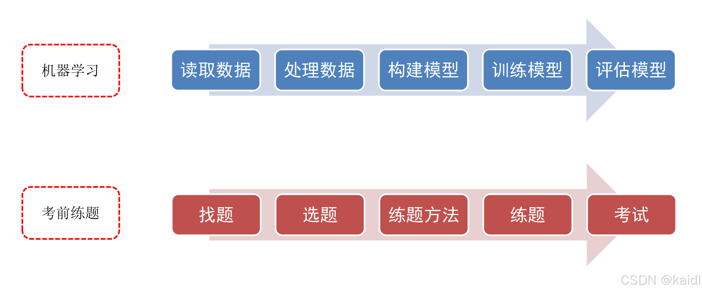
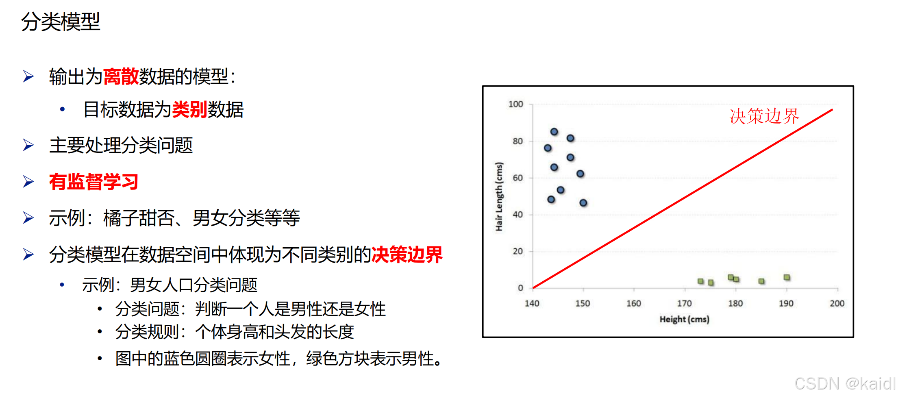
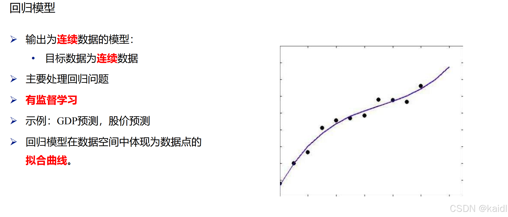
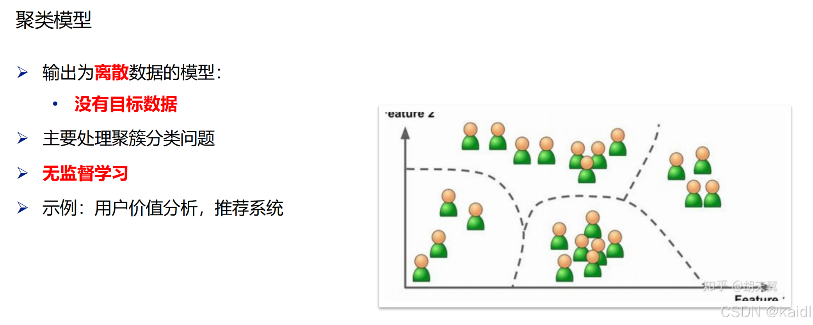

---
## 引言
机器学习不仅是理论学科，更是解决实际问题的强大工具。本文通过实例与图表，深入解析机器学习的基本流程、核心模型及常见挑战，帮助读者构建完整的知识框架。

---
## 一、机器学习的基本流程
机器学习的核心流程可概括为以下五步：

1. **读取数据**：从结构化（表格）或非结构化（图像、文本）数据源获取信息。  
2. **处理数据**：清洗数据（去噪、填充缺失值）、特征工程（提取关键属性）。  
3. **构建模型**：根据任务选择算法（如分类、回归、聚类）。  
4. **训练模型**：用训练集优化参数，使模型捕捉数据规律。  
5. **评估模型**：通过测试集验证模型泛化能力，调整超参数提升性能。
---
## 二、机器学习的主要模型
### 1. 分类模型

### 2. 回归模型

### 3. 聚类模型

---
## 三、实战案例：钱能让人快乐吗？
### 数据与目标

- **数据集**：各国人均GDP与生活满意度评分。  
- **任务**：构建回归模型预测GDP对幸福感的影响。### 步骤解析

1. **数据读取与清洗**：剔除异常值（如极端贫困或富裕国家）。  
2. **模型选择**：使用线性回归（简单可解释性强）。  
3. **训练与验证**：划分训练集与测试集，评估R²值。  
4. **结果分析**：发现GDP与幸福感呈正相关，但存在边际递减效应。

---
## 四、机器学习的主要挑战
### 1. 数据相关问题

- **数据不足**：小数据集易导致模型过拟合（需数据增强或简化模型）。  
- **数据偏差**：幸存者偏差（如1936年美国大选预测失败案例）。  
- **低质量数据**：噪声与缺失值需手工处理或插值。### 2. 模型相关问题

- **过拟合**：复杂模型捕捉噪声（如高阶多项式拟合GDP数据）。  
- **欠拟合**：模型过于简单（如仅用发长判断性别）。  
- **模型验证**：需划分训练集、验证集与测试集，采用交叉验证。### 3. 特征与假设问题

- **不相关特征**：需通过特征选择或提取优化（如“职业”对房价预测可能无效）。  
- **数据假设**：根据任务选择合理模型（如线性模型 vs 神经网络）。
---
## 五、解决策略与工具

1. **应对过拟合**：正则化（L1/L2）、Dropout（神经网络）、早停法。  
2. **应对欠拟合**：增加模型复杂度、引入交互特征。  
3. **数据增强**：合成数据（如图像旋转、文本同义词替换）。  
4. **自动化工具**：Scikit-learn（模型选择）、TensorFlow（深度学习）、AutoML（自动调参）。
---
## 结语
机器学习的成功依赖于数据、模型与算法的协同优化。理解流程、掌握模型、规避挑战，方能将理论转化为实际价值。未来，随着自动化工具的发展，机器学习门槛将进一步降低，但其核心——数据驱动与逻辑推理——始终是技术进步的基石。  
> **学习资源推荐**：  

- 代码实战：[Kaggle机器学习入门竞赛](https://www.kaggle.com/) 
- 工具指南：[Scikit-learn官方文档](https://scikit-learn.org/)
