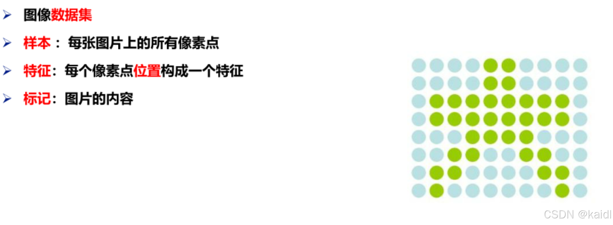

---
## 引言
机器学习作为人工智能的核心技术之一，正在深刻改变我们的生活。无论是垃圾邮件过滤、图像识别，还是股票预测，背后都离不开机器学习的身影。本文将从基础概念出发，结合实例，带你快速了解机器学习的核心内容。

---

## 一、什么是机器学习？
**定义**：机器学习是研究计算机如何模拟人类学习行为的学科，通过从数据中提取规律，不断优化自身性能。  
### 人类学习 vs 机器学习

- **人类学习**：通过经验总结规律（例如，通过橘子颜色和大小判断甜度）。  
- **机器学习**：从数据中学习规律（例如，收集大量橘子的颜色、大小数据，训练模型预测甜度）。**核心过程**：  

1. **数据获取**：收集样本数据（如橘子的属性、邮件的关键词）。  
2. **模型训练**：选择算法（如决策树、SVM）从数据中学习规律。  
3. **评估与优化**：验证模型效果，调整参数提升性能。
---
## 二、为什么要用机器学习？
### 传统方法的局限性
以**垃圾邮件过滤**为例：  

- **传统规则方法**：人工定义关键词（如“免费”“信用卡”），但规则复杂且更新频繁，维护成本高。  
- **机器学习方法**：自动从数据中发现规律，适应新变化（如“免费”改为“不收费”），无需人工干预。**机器学习的优势**：  

- **高效处理复杂问题**：减少人工规则编写。  
- **动态适应数据变化**：实时更新模型，应对新场景。  
- **挖掘深层规律**：从海量数据中发现隐藏关联。
---
## 三、机器学习的基本流程

1. **数据准备** 
- **结构化数据**：表格形式（如橘子的颜色、大小）。  
- 

- **非结构化数据**：图像、文本、音频（如像素点、单词频率）。  
- 

- **数据划分**：分为训练集（70%~80%）和测试集（20%30%）。
1. **模型训练** 
- 选择算法（如监督学习中的SVM、无监督学习中的K-means）。  
- 输入训练数据，调整模型参数。
1. **模型评估与优化** 
- 用测试集验证模型准确率。  
- 根据结果优化算法或增加数据量。
---
## 四、机器学习的种类
### 1. 按学习方式分类

- **监督学习**：数据带标签（如分类、回归），适用于垃圾邮件检测。  
- **无监督学习**：数据无标签（如聚类），适用于用户分组分析。  
- **半监督学习**：混合少量标签数据和大量无标签数据，常用于图像识别。  
- **强化学习**：通过奖励机制学习策略（如游戏AI、自动驾驶）。### 2. 按学习模式分类

- **批量学习**：一次性用全量数据训练，适合静态场景（如语音识别）。  
- **在线学习**：持续接收数据流，动态更新模型，适合实时预测（如股票价格）。### 3. 按实现方式分类

- **基于实例学习**：通过相似性判断（如KNN算法）。  
- **基于模型学习**：构建抽象模型进行预测（如线性回归）。
---
## 五、经典应用场景

1. **分类任务**：垃圾邮件过滤、图像识别。  
2. **回归任务**：房价预测、销量分析。  
3. **聚类任务**：客户分群、新闻主题分类。  
4. **强化任务**：机器人控制、游戏AI。
---
## 结语
机器学习通过“数据驱动”的方式，让计算机具备了从经验中学习的能力。随着算法和算力的进步，其应用场景将更加广泛。对于初学者，掌握基础概念和流程是第一步，后续可深入实践经典算法（如SVM、决策树），逐步探索复杂模型的魅力。  
> **学习资源推荐**：  

- 教材：《机器学习实战（第二版）》
