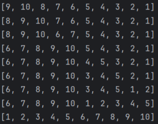

**逻辑**
    两个有序数组合成一个有序数组是非常简单的，建个新数组，两个小数组分别给个指针从左跑到右，谁小谁先进新数组就好了，但问题是哪来的有序数组给我合呢？
        这个时候我们的**归并排序**就来了，通过递归（也可以用循环）把数组中的元素拆到**只剩一个数**为止，这个时候每个数都可以看做一个**有序数组**，然后再一层层**合并**回去排序（是因为递归完再合并所以叫归并吗），每次返回的合并数组都是有序的，共合并n-1次（如下图）。


 **简述**：用**递归**将数组**拆分**，**合并**成**有序数组**后返回，重复**length-1**次
**代码**
MergeSort
```java
import java.util.Arrays;
import java.util.stream.IntStream;
 
public class MergeSort {
    public static void main(String[] args) {
        int[] arr = { 10, 9, 8, 7, 6 , 5, 4, 3, 2, 1};
        mergeSort(arr,0,arr.length-1,new int[arr.length]);
        System.out.println(Arrays.toString(arr));
    }
 
    public static void mergeSort(int[] arr,int left,int right,int[] temp){
        if (left >= right)  return;
        int mid = (left + right) / 2;
        mergeSort(arr,left,mid,temp);
        mergeSort(arr,mid+1,right,temp);
        merge(arr,left,right,temp);
    }
    public static void merge(int[] arr, int left, int right, int[] temp){
        int mid = (left + right) / 2;
        int i = left;
        int j = mid + 1;
        int t = left;
        while (i <= mid && j <= right){
            if(arr[i]<arr[j])temp[t++] = arr[i++];
            else temp[t++]=arr[j++];
        }
        while (i <= mid)temp[t++] = arr[i++];
        while (j <= right) temp[t++] = arr[j++];
//      从left到right的循环，将辅助数组temp赋值给原数组arr  
        IntStream.range(left, right+1).forEach(p -> arr[p] = temp[p]);
    }
 
}
```
